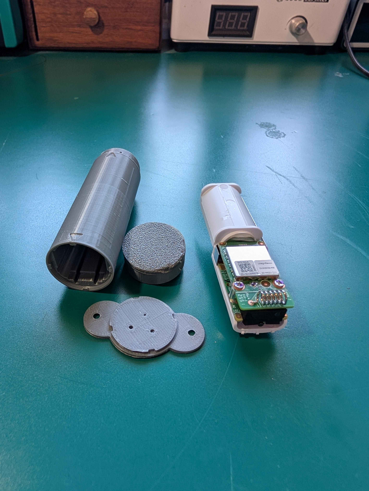

 
 
 

- Start by disassembling the sensor. I have an IFixit guide that details this process. Follow the guide up to step 5: [https://www.ifixit.com/Guide/Ubiquiti+Unifi+Entry+Sensor+%7C+USL-Entry/211997](<https://www.ifixit.com/Guide/Ubiquiti+Unifi+Entry+Sensor+%7C+USL-Entry/211997>)
  
 
 
 
 

- Next, trim the small plastic bumps along the Battery holder on the main body.
	- use a pair of flush cutters to cut off the bumps.

	
	
	

- Insert your sensor main body into the 3d printed case.
	- Make sure to align the 2 parallel slots with the plastic clips on the bottom of the main body.

	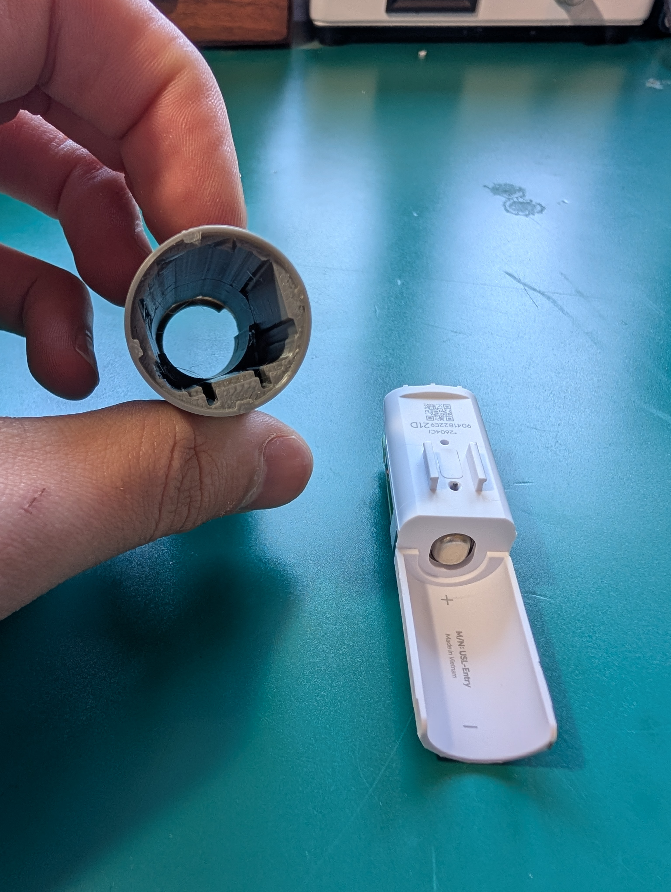
	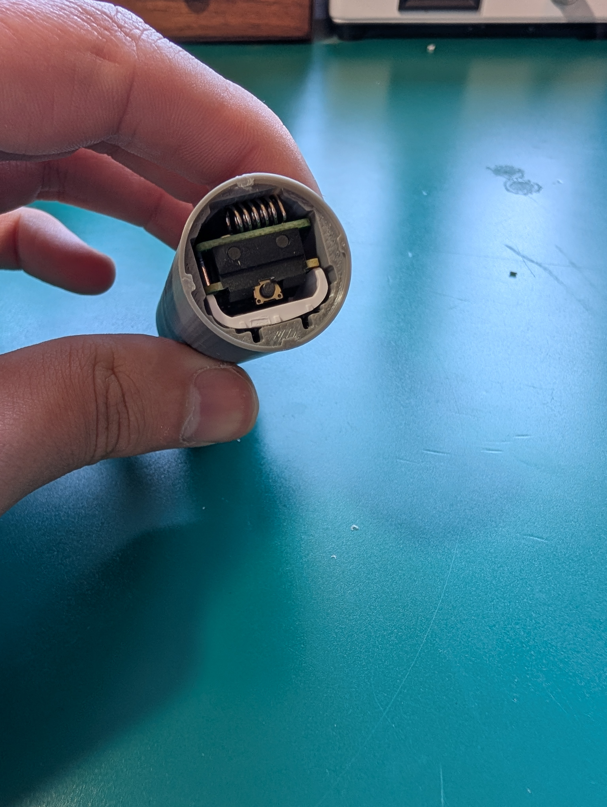
	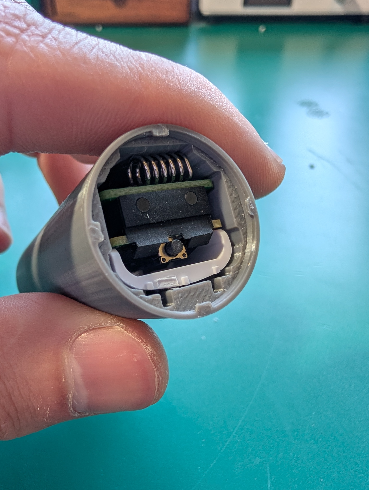

- Align the front twist-cap with the locking pegs, and turn clockwise to lock it into place.
	- The two alignment marks should line up once fully seated.

	
	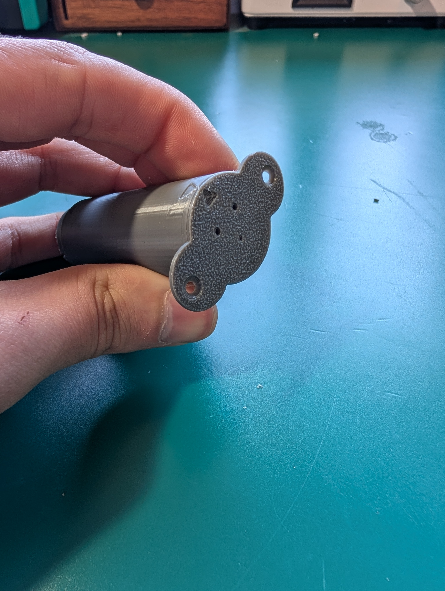

   
- Flip the case and push the battery into the hole, fully seat.
- Place the negative battery contact into the rear twist-cap.
	- the contact plate has cutouts on the bottom edge and holes above the spring contact. The rear twist cap has matching features to help align it properly
 	- you will have wanted to keep the adhesive on the back of the contact plate.
- Align the battery contact connector pin with the corresponding notch in the main case.
- Align the nubs in the cap with the slots in the main case, then push the cap down and twist clockwise to lock it in place.
	- If the metal connector pin on the battery contact binds or snags while pressing or twisting the cap into place, you may need to gently bend the pin outward so that it presses lightly against the wall of the main shell
- you should see the power LED on the face turn on within 5 seconds

	
	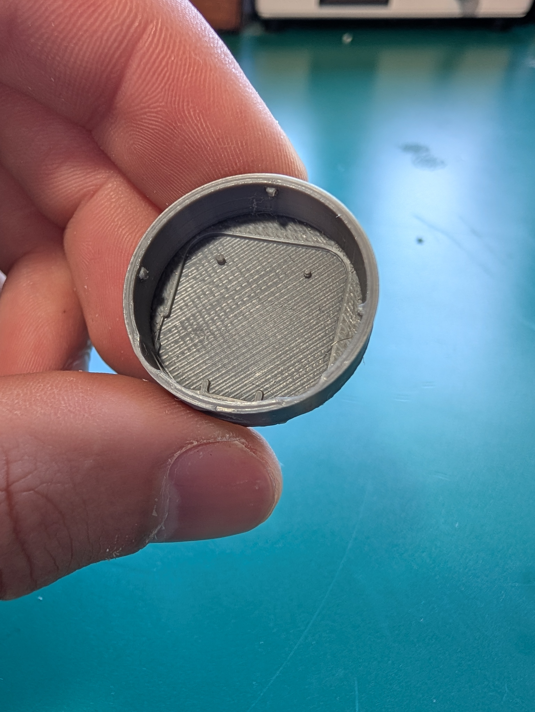
	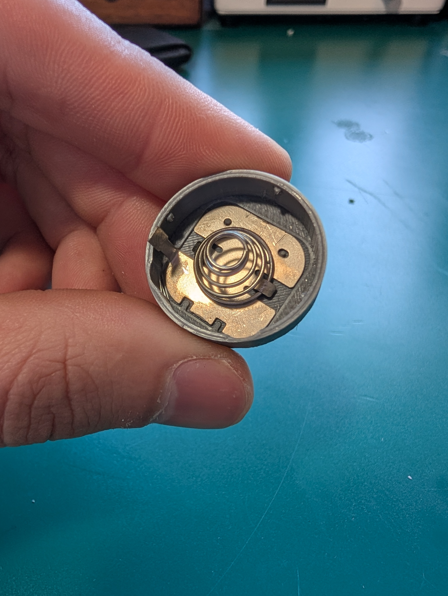
	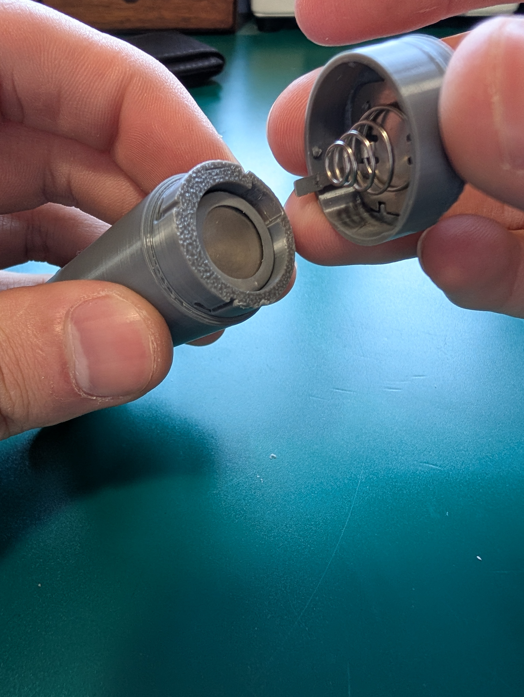
	

 
 
 

 - Now move on to the magnet.
 - Remove the back cover using the included tool.
 	- I attempted to remove the magnet from its case, but was unsucsessful. soaking in alcahol and heating with rework station did not loosen the adhesive at all.

   

	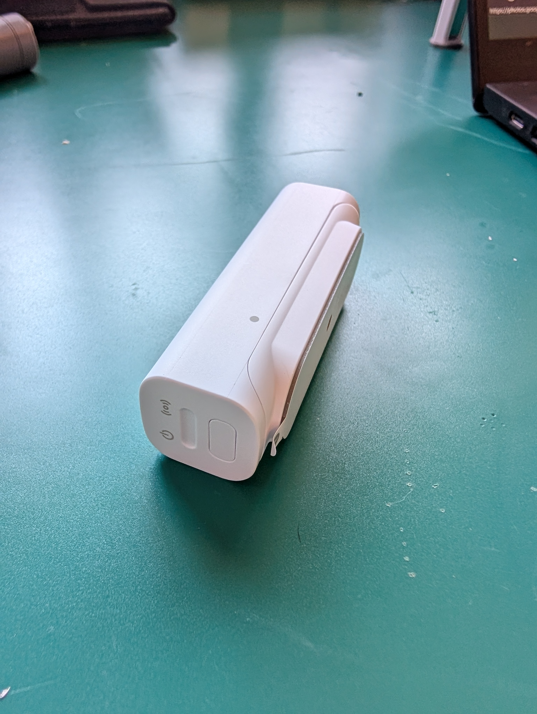
	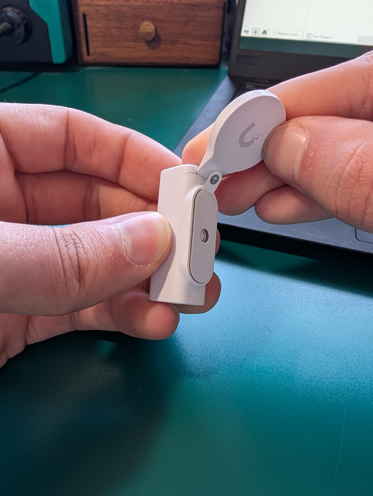
	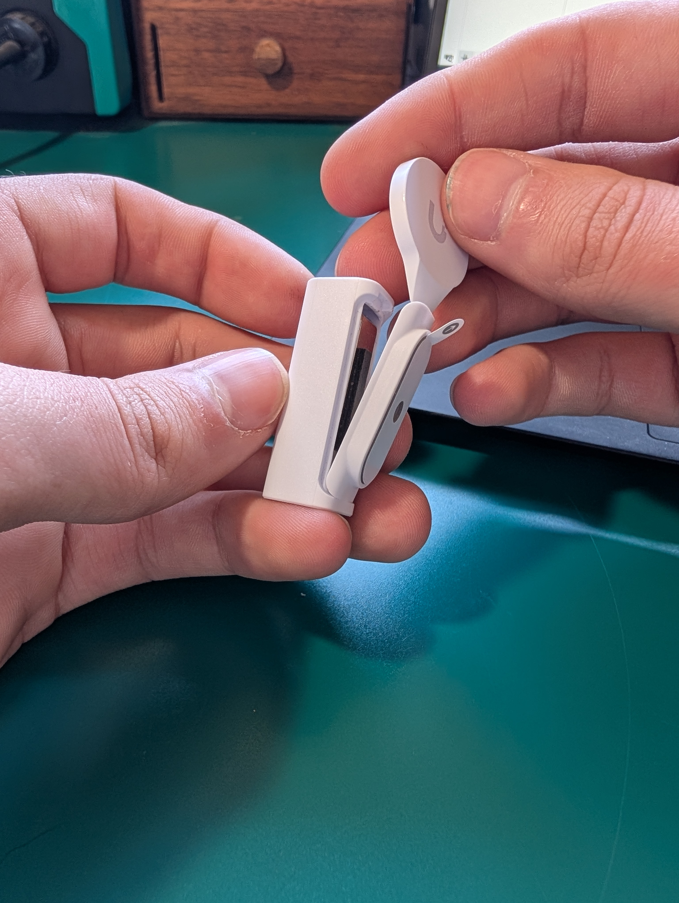

 - Press the magnet with its case into the new shell

	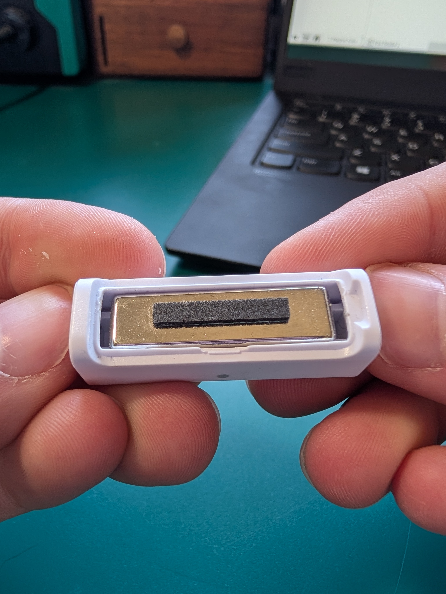

