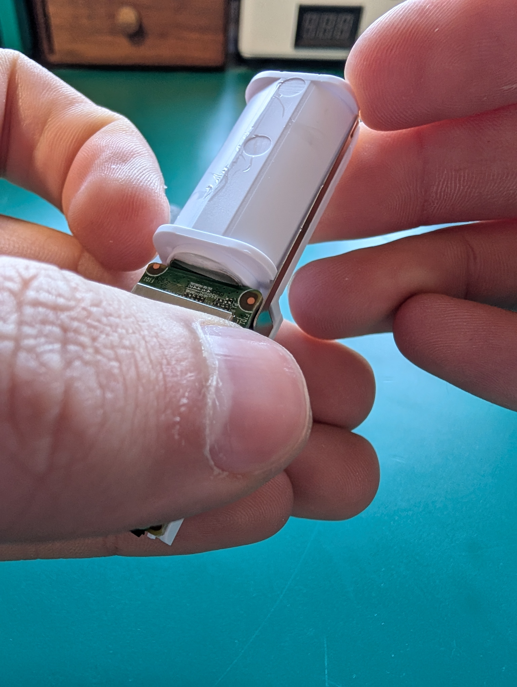
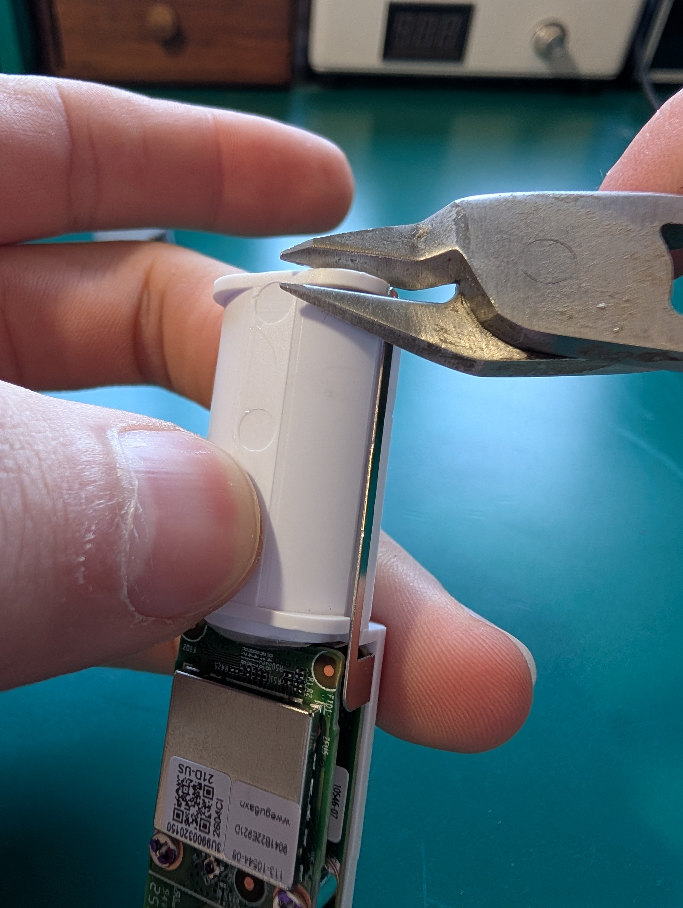
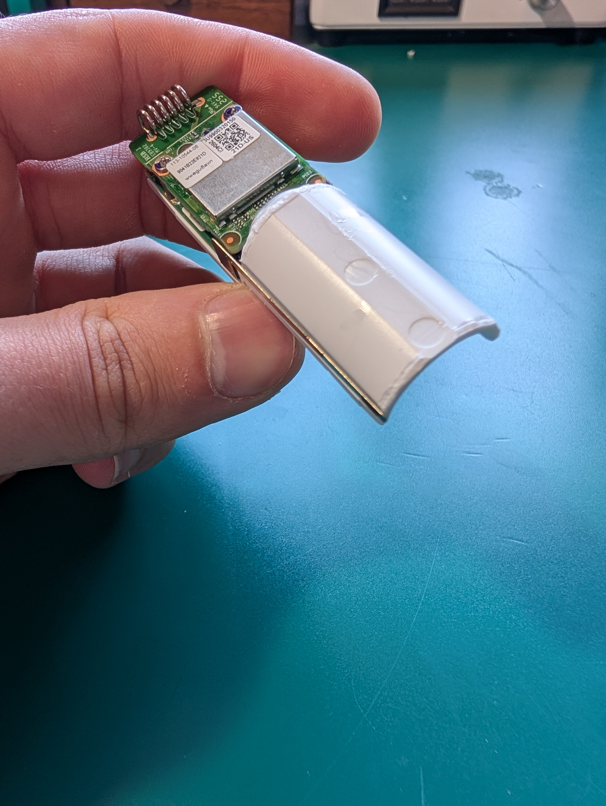
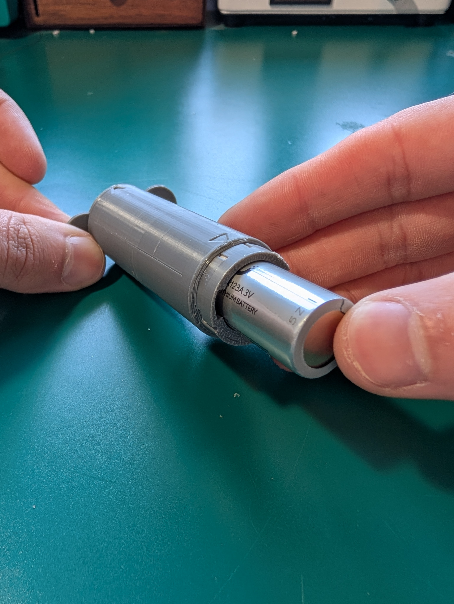

[Click here to go home](https://github.com/Joel-Eagles/Recessed-Unifi-Entry-Senser/tree/main)

[Click here for assembly guide](https://github.com/Joel-Eagles/Recessed-Unifi-Entry-Senser/blob/main/Assembly.md)

 
 

- Mark a centerline along the top of your door
- Align the "Main" Template so that all 3 holes line up with the centerline
  - It is best to position the sensor close to the opening side of the door. This makes it more sensitive to the door opening
- Mark the center point of the 3 circles with a pencil
  - Measure and note the distance from the edge of the door to the center mark. this will be used to position the magnet later. 

	
	
	

 

 
 
 
 
 
 

- With a 5/8" forstner bit, drill on the two outside marks, leaving the 1 in the middle
  - These only need drilled enough to recess the cap into the door, only .05" or about 3/64
  - If you don't mind the look, and your door gap has room for it, you dont have to recesss the cap, and you can skip this step

 
 
 
 
 
 
 
 
 

 
 
 
 
 
 

- With a 1" forstner bit, dill out the center mark.
  - mark the depth you need to drill by lining up the sensor case with your drill bit and mark the end with a tape flag (add a small amount extra for safety).

 
 
 
 
 
 
 
 
 

 
 
 
 
 
 

- Slide in sensor and screw in through the ears.
  - I used some #4x1/2" wood screws for this

 
 
 
 
 
 
 
 
 

 
 
 
 
 
 

- Take the sensor's distance from the outside face of your door (should be half the thickness of your door). Mark this on the top of the door casing off of the door stop molding
- Take the distance from of the edge of the door and add the width of your door's gaps (close the door and measure the distance from the door edge to the door casing). mark this distance on the top of the door casing off of the door jam.

 
 
 
 
 
 
 
 
 

 
 
 
 
 
 

- Align the center hole of the "Magnet" template with the intersecting lines you just marked on the top of the door casing.
- mark the 2 outer circle centers

 
 
 
 
 
 
 
 
 

 
 
 
 
 
 

- With a 5/8" forstner bit, drill on the two outside marks, leaving the 1 in the middle
  - These only need drilled enough to recess the cap into the door, only .05" or about 3/64
  - If you don't mind the look, and your door gap has room for it, you dont have to recesss the cap. and you can skip this step

 
 
 
 
 
 
 
 
 

 
 
 
 
 
 

- With a 3/4" forstner bit, dill out the center mark.
  - mark the depth you need to drill by lining up the magnet case with your drill bit and mark the end with a tape flag (add a small amount extra for safety).

 
 
 
 
 
 
 
 
 

 
 
 
 
 
 

- Slide in Magnet and screw in through the ears.
  - I used some #4x1/2" wood screws for this
